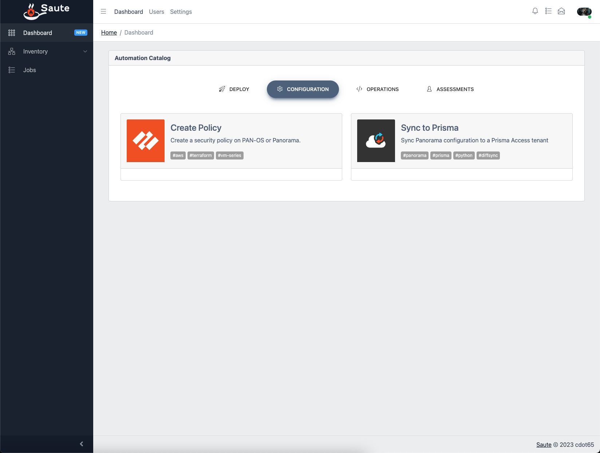

# Saute 🚀🌐

[](https://github.com/cdot65/saute/actions/workflows/backend.yml)

## Table of Contents

- [Saute 🚀🌐](#saute-)
  - [Table of Contents](#table-of-contents)
  - [Introduction](#introduction)
    - [Screenshot](#screenshot)
  - [Backend Overview](#backend-overview)
  - [Frontend Overview](#frontend-overview)
  - [Project Dependencies](#project-dependencies)
  - [Deployment Steps](#deployment-steps)
  - [Technical Features](#technical-features)
    - [Backend Features](#backend-features)
    - [Frontend Features](#frontend-features)
  - [Working with the Backend Application](#working-with-the-backend-application)
    - [Django Admin Panel](#django-admin-panel)
  - [Working with the Frontend Application](#working-with-the-frontend-application)
    - [Angular Basics](#angular-basics)
    - [Interacting with the Backend API](#interacting-with-the-backend-api)

## Introduction

Saute is a web application consisting of separate backend and frontend components. Its goal is to provide a simple and intuitive interface for managing products from Palo Alto Networks.

The backend is built using Django and PostgreSQL, while the frontend is developed with Angular. The backend provides a robust REST API, and the frontend consumes this API to offer a seamless user experience.

The Saute now also includes an Operational module, which allows users to generate reports for Panorama devices.

### Screenshot



## Backend Overview

The backend is designed using Django and Django Rest Framework (DRF), featuring a modular architecture with well-structured applications. This setup lays a strong foundation for future development.

## Frontend Overview

The frontend is developed using Angular, providing a seamless user experience while interacting with the backend REST API.

## Project Dependencies

To work with this project, you'll need the following software installed on your system:

- Docker
- Docker Compose
- Python 3.9

## Deployment Steps

To deploy both backend and frontend using Docker and Docker Compose, follow these steps:

1. Ensure Docker and Docker Compose are installed on your system.

2. Create an `.env` file in the backend directory and update it accordingly.

    ```bash
    cp backend/.env.example backend/.env
    vim .backend/.env
    ```

    ```conf
    DJANGO_ALLOWED_HOSTS=['localhost', '127.0.0.1', '*']
    DJANGO_DEBUG=True
    DJANGO_SECRET_KEY=qKJ9h-ph4VY7zJIQnnRuvR-MARWs-b2tOdRtJZpeXfc
    POSTGRES_USER=django_user
    POSTGRES_PASSWORD=django_password
    POSTGRES_DB=postgres
    POSTGRES_HOST=db
    POSTGRES_PORT=5432
    ```

3. Build the Docker images and start the containers.

    ```bash
    docker-compose up --build
    ```

4. Wait for the web application to start (you can check the logs to ensure everything is running smoothly):

    ```bash
    docker-compose logs -f
    ```

5. Perform database migrations.

    ```bash
    docker-compose exec backend python manage.py makemigrations
    docker-compose exec backend python manage.py migrate
    ```

6. Create a superuser.

    ```bash
    docker-compose exec backend python manage.py createsuperuser
    ```

Your application should now be up and running! 🎉

## Technical Features

### Backend Features

- PostgreSQL as the database
- Celery workers for asynchronous tasks
- Redis as the Celery broker
- Django Rest Framework (DRF) for creating a RESTful API
- Django Allauth for user authentication and registration
- API documentation using Redoc and Swagger

### Frontend Features

- Angular framework for building a dynamic and responsive UI
- Angular Material for a modern, sleek design
- Integration with the backend DRF REST API
- Routing and route guards for secure navigation
- Operational module for generating reports for Panorama devices
- Login and Registration forms with validation
- Frontend to execute Python scripts on the backend celery workers

## Working with the Backend Application

### Django Admin Panel

The Django admin panel is a powerful built-in tool for managing your application's data. With the admin panel, you can easily manage users, groups, and other models in your application. To access the admin panel:

1. Create a superuser (if you haven't already):

    ```bash
    docker-compose exec backend python manage.py createsuperuser
    ```

    Follow the prompts to create a superuser with a username, email, and password.

2. Access the admin panel by visiting `http://localhost:8000/admin` in your browser.

3. Log in with the superuser credentials you created earlier.

4. You can now manage users, groups, and other models through the admin panel. Click on the model you want to manage and add, edit, or delete entries as needed.

## Working with the Frontend Application

### Angular Basics

The frontend of this project is built using Angular, a popular web application framework. To work with the frontend, you should be familiar with Angular's key concepts, such as components, services, and routing. You can learn more about Angular from the [official documentation](https://angular.io/docs).

### Interacting with the Backend API

The frontend interacts with the backend API using Angular's HttpClient. The AuthService and other services are responsible for making API calls to the backend. These services are injected into components using Angular's dependency injection system.

For example, in the LoginComponent, the AuthService is used to log in a user by making a POST request to the `/api/v1/accounts/login/` endpoint. Upon successful login, the authentication token is stored in a cookie, and the user is redirected to the Homepage component.

To add more functionality or interact with additional API endpoints, create new services or modify existing ones. Then, inject those services into the components that require the new functionality.
